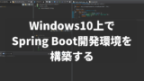
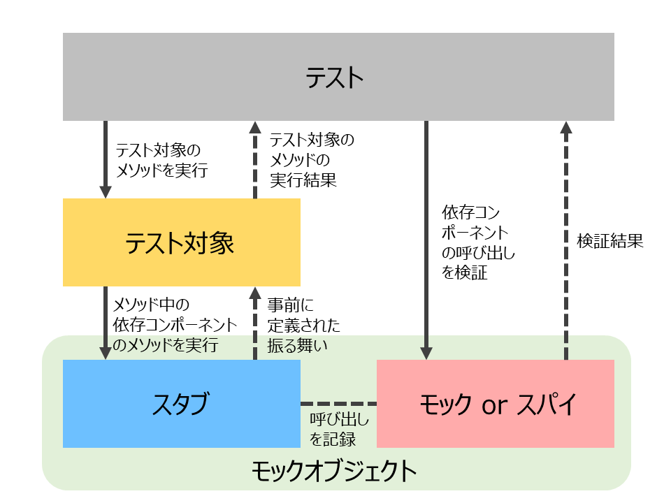
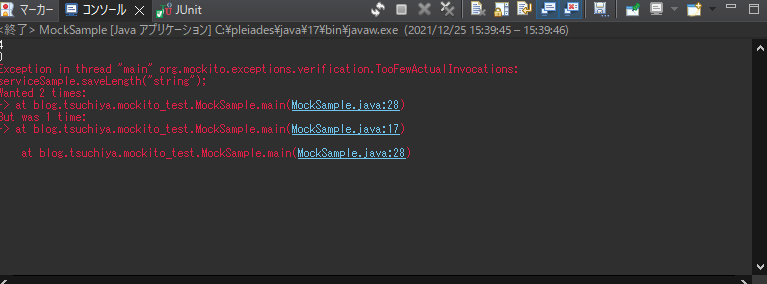
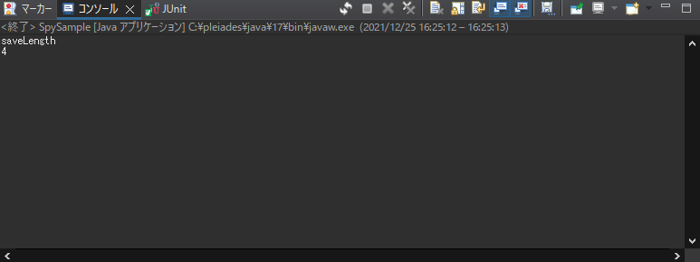

# JavaのモックフレームワークMockitoの導入方法と使い方

作成年月日：2021.12.25 更新年月日：2022.09.23

ちゃんとしたユニットテストをやろうとすると、クラスやメソッドのモック化は避けられません。

Javaでよく使われるモックフレームワークにMockitoがありますが、

- モックやスタブの概念が理解できない
- 導入方法がわからない
- どういうふうに使うのかイメージが沸かない

などの疑問点を持つ人も多いでしょう。

この記事では、[Githubで公開したサンプルコード](https://github.com/gsg0222/mockito_test)をもとにこれらの疑問に答えてこうと思います。

ユニットテストをするのにモック化は必要不可欠な要素です。この記事を読んでMockitoの基本的な使い方ができるようになってください。

この記事を読むとわかること

- モックやスタブの概念
- Mockitoの導入方法
- Mockitoでmockやspyを使う方法
- ユニットテストでの利用法

前提条件

- 解説ではPleiades All in One Eclipseを使う
- Javaのバージョンは17
- Mockitoのバージョンは4.2.0

関連記事

Pleiades All in One Eclipseのインストール方法は[この記事](https://www.tsuchiya.blog/spring-boot-development-environment/)の1を参考にしてください。



Windows10上でSpring Boot開発環境を構築する

モックフレームワークと関連が強い[DI（Dependency injection：依存性注入）の説明](https://www.tsuchiya.blog/spring-boot-step5/)をSpring Bootを使って行っています。


[v3.1.0対応]Spring Boot入門：ServiceとDI(依存性の注入)

目次

1. [この記事のソースコード](https://www.tsuchiya.blog/mockito-basic/#toc1)
2. Mockitoの導入方法
   1. [Mavenを使う場合](https://www.tsuchiya.blog/mockito-basic/#toc3)
   2. [Gradleを使う場合](https://www.tsuchiya.blog/mockito-basic/#toc4)
   3. [jarファイルを使う場合](https://www.tsuchiya.blog/mockito-basic/#toc5)
3. モックとスタブの概念
   1. [モックとは](https://www.tsuchiya.blog/mockito-basic/#toc7)
   2. [スタブとは](https://www.tsuchiya.blog/mockito-basic/#toc8)
4. [サンプルとして使うServiceとRepository](https://www.tsuchiya.blog/mockito-basic/#toc9)
5. [Mockitoでmockを利用する](https://www.tsuchiya.blog/mockito-basic/#toc10)
6. [Mockitoでspyを利用する](https://www.tsuchiya.blog/mockito-basic/#toc11)
7. Mockitoをユニットテストで利用する
   1. [saveLengthTestByMockの説明](https://www.tsuchiya.blog/mockito-basic/#toc13)
   2. [saveLengthTestBySpyの説明](https://www.tsuchiya.blog/mockito-basic/#toc14)
8. [まとめ：Mockitoでモック化とスタブ化を自在に使おう](https://www.tsuchiya.blog/mockito-basic/#toc15)

## この記事のソースコード

最初に書いたとおり、この記事のソースコードは[Githubに公開](https://github.com/gsg0222/mockito_test)しています。


GitHub - gsg0222/mockito_test

Eclipseにインポートする方法は次の[記事を参考](https://www.tsuchiya.blog/github-to-eclipse/)にしてください。記事ではSpring Bootのプロジェクトをインポートすると書いてありますが、今回のMockitoに関するサンプルコードもMavenを利用しており、ほぼ同じ作業でインポートできます。


GithubからSpring BootプロジェクトをEclipseにインポートする

## Mockitoの導入方法

Mockitoの導入は難しくありません。Maven、Gradle、Jarを使う場合を説明します。なお、サンプルコードではMavenを使っています。

### Mavenを使う場合

Mavenを使ったプロジェクトでMockitoを使いたい場合、pom.xmlのdependenciesに以下の内容を追加します。

```
		<dependency>
			<groupId>org.mockito</groupId>
			<artifactId>mockito-core</artifactId>
			<version>4.2.0</version>
			<scope>test</scope>
		</dependency>
```

指定したバージョンはこの記事を書いた時点でのものです。最新のバージョンを知りたい場合は[Maven RepositoryのMockitoのページ](https://mvnrepository.com/artifact/org.mockito)からmockito-coreを確認してください。

### Gradleを使う場合

Gradleの場合は、build.gradleのdependenciesに以下を追加します。

```
testImplementation 'org.mockito:mockito-core:4.2.0'
```

Mavenと同じく、最新のバージョンを使いたい場合は[Maven RepositoryのMockitoのページ](https://mvnrepository.com/artifact/org.mockito)からmockito-coreを確認してください。

### jarファイルを使う場合

最近はあんまりjarを使う機会も少ないでしょうが、jarは[次のURL](https://repo1.maven.org/maven2/org/mockito/mockito-core/)から取得できます。


Central Repository: org/mockito/mockito-core

利用する時点の最新版をダウンロードすると良いでしょう。

## モックとスタブの概念

Mockitoに限らず、モックフレームワークを使う場合、モックとスタブの概念は知っておく必要があります。

どちらも知ってしまえばそこまで難しいことでもありません。

### モックとは

モックとは、テスト対象からの入力を受け取る仕組みのことです。

主な仕事としては以下のようなことを行います。

- テスト対象からの入力を受け取る
- 実際に受け取った値を記録して検証する

Javaの場合は、あるインスタンスで呼び出されたメソッドと受け取った引数、および回数を記憶する仕組みがモックということになります。

### スタブとは

スタブはモックとは逆に何らかの値を返す仕組みです。

- 入力に対応した出力を定義しておき、入力が来たら決まった出力をする

Javaの場合は、特定の引数に対応する形でメソッドの戻り値を決めておくのがスタブということになります。

### 三原による補足

上手く、スタブ、モック、スパイを表していると思った図を、下に挿入する。

出所：[【Java】Mockitoの飲み方（入門） | CCT-recruit (cct-inc.co.jp)](https://recruit.cct-inc.co.jp/tecblog/java/mockito-primer/)



## サンプルとして使うServiceとRepository

Mockitoを実際に使う前に、サンプルとして利用するクラスを説明しておきます。

簡単なロジックを持つServiceクラスと、Serviceから使われるRepositoryクラスを準備しました。どちらもサンプルなので全く実用性はありません。

ServiceにRepositoryをDI（Dependency injection：依存性注入）して使うことを想定しています。

**ServiceSample：**

```
package blog.tsuchiya.mockito_test;

import lombok.RequiredArgsConstructor;

/**
 * ビジネスロジックを実装するクラス。
 */
@RequiredArgsConstructor
public class ServiceSample {

	/** DBアクセサのダミー */
	private final RepositorySample rs;
	
	/**
	 * 引数の文字列の長さを保存して、その値を返す。
	 * @param target
	 * @return
	 */
	public int saveLength(String target) {
		return rs.saveLength(target);
	}
}
```

**RepositorySample：**

```
package blog.tsuchiya.mockito_test;

/**
 * データベースへのアクセスなどを行う。
 * 今回はMockitoの使い方を勉強するだけなので
 * 実際にはほとんど何もしないダミークラス。
 */
public class RepositorySample {

	/**
	 * 長さを保存する。
	 * 今回はダミー実装で標準出力に出力するだけ。
	 * @param length
	 */
	public int saveLength(String target) {
		// 本当はDBアクセスとかをする
		System.out.println("saveLength");
		return saveLengthImpl(target);
	}

	/**
	 * saveLengthの実装。Spyを試すために無意味な形で実装した。
	 * @param target
	 * @return
	 */
	public int saveLengthImpl(String target) {
		// 本当はDBアクセスとかをする
		var length = target.length();
		System.out.println("saveLengthImpl");
		return length;
	}
}
```

## Mockitoでmockを利用する

では実際にMockitoを使ってみます。まずはmockから。

Mockito.mockメソッドは、引数にとったクラスすべてをモック化し、すべてのメソッドは簡易的なスタブ化します。

要するに、すべてのメソッドは受け取った引数と回数を保存するようになり、同時に決まった値を返すようになります。（戻り値がオブジェクトならnullを、プリミティブなら0またはfalseを）

具体的には次のような使い方をします。

**MockSample(src/java/testでしかMockitoが使えないので、そちらにおいてあります)：**

```
package blog.tsuchiya.mockito_test;

import static org.mockito.Mockito.*;

public class MockSample {

	public static void main(String[] args) {
		// モックを作成
		ServiceSample mockSample = mock(ServiceSample.class);
		// インスタンスにスタブメソッドを定義
		// ある引数が渡された場合の戻り値を設定する
		// 本来の実装だと6を返すはずだけど、テストのため4を返すことにする
		doReturn(4).when(mockSample).saveLength("string");
		
		// ちゃんと定義通り値を返すか確認
		// 上で定義した通り4を返すはず
		System.out.println(mockSample.saveLength("string"));
		
		// 定義されていない引数でメソッドを呼ぶと0が返ってくる
		// 戻り値がObjectだとnulが返される
		System.out.println(mockSample.saveLength("not defined"));
		
		// メソッドが指定回数呼び出されていることを確認
		// 指定した回数呼ばれていた場合は何も出力しない
		verify(mockSample, times(1)).saveLength("string");
		
		// もし指定通りの回数呼ばれていないと例外をthrowする
		verify(mockSample, times(2)).saveLength("string");

	}

}
```

このクラスの実行結果は次のようになります。



mockSample.saveLength(“string”)が実行されているのに、repositoryで実行されるはずのprintlnが実行されていないことがわかります。

これは、mockSample.saveLengthがモック化されているからです。さらに、mockSample.saveLength(“string”)の実行結果が4になっています。これは、

```
		// インスタンスにスタブメソッドを定義
		// ある引数が渡された場合の戻り値を設定する
		// 本来の実装だと6を返すはずだけど、テストのため4を返すことにする
		doReturn(4).when(mockSample).saveLength("string");
```

ここで実行しているdoReturnメソッドでsaveLengthメソッドにstringという文字列が渡された場合の戻り値を定義しているからです。mockメソッドで作られたばかりのServiceSampleインスタンスは、すべてのメソッドがデフォルトのnull、0、falseを返すスタブになっています。しかし、doReturnメソッドを使うことで引数と戻り値を自由に定義することができるのです。

doReturnメソッドの書式は「doReturn(戻り値).when(対象インスタンス).対象のメソッド(引数)」です。

また、モックとしての仕事もしていて、メソッドがどんな引数で何回呼ばれたのかを記憶しています。

Mockito.verifyメソッドで呼び出された引数と回数を確認することができます。

```
		// メソッドが指定回数呼び出されていることを確認
		// 指定した回数呼ばれていた場合は何も出力しない
		verify(mockSample, times(1)).saveLength("string");
```

ちょっと馴染みにくい書式ですが、「verify(対象のインスタンス, times(呼ばれた回数)).対象のメソッド()」とすることで想定通りの引数および回数実行されているのか確認できます。

仮に指定の回数呼ばれていない場合、verifyメソッドは例外を投げます。実行結果の最後の例外はverifyで失敗したからです。

## Mockitoでspyを利用する

続いてspyメソッドです。mockメソッドと違い、spyメソッドはモック化は行いますがスタブ化は行いません。

spyメソッドを使った場合は、必要に応じていくつかのメソッドを手動でスタブ化する必要があります。

**SpySample(src/java/testでしかMockitoが使えないので、そちらにおいてあります)：**

```
package blog.tsuchiya.mockito_test;

import static org.mockito.Mockito.*;

public class SpySample {

	public static void main(String[] args) {
		// RepositorySampleのうち、saveLengthImplだけをスタブ化
		RepositorySample spySample = spy(RepositorySample.class);
		doReturn(4).when(spySample).saveLengthImpl("string");

		// saveLengthImplを呼んでいるsaveLengthを実行
		// 長さ６の文字列を渡しているけど、スタブ化したメソッドが4を返す
		// また、saveLengthのprintlnは実行されるけどsaveLengthImplのは実行されない
		System.out.println(spySample.saveLength("string"));

		// スタブ化したメソッドが指定回数呼び出されていることを確認
		verify(spySample, times(1)).saveLength("string");
		verify(spySample, times(1)).saveLengthImpl("string");
	}
}

```

SpySampleではRepositorySampleクラスのインスタンスをspyメソッドで作成し、saveLengthImplだけをスタブ化しました。

実行結果は以下の通りとなります。



スタブ化しなかったsaveLengthメソッドは通常の通り実行され、スタブ化したsaveLengthImplのprintlnは実行されませんでした。

saveLengthもモック化はされているので、verifyメソッドで呼び出し回数を確認することができています。

## Mockitoをユニットテストで利用する

それでは、実際にMockitoを使ったテストを作ってみましょう。

**ServiceSampleTest（src/test/javaにある）：** 

```
package blog.tsuchiya.mockito_test;

import static org.junit.jupiter.api.Assertions.*;
import static org.mockito.Mockito.*;

import org.junit.jupiter.api.DisplayName;
import org.junit.jupiter.api.Test;

class ServiceSampleTest {

	@Test
	@DisplayName("saveLengthメソッドが正しくRepositoryに値を渡している")
	void saveLengthTestByMock() {
		RepositorySample repositoryMock = mock(RepositorySample.class);
		when(repositoryMock.saveLength("test")).thenReturn(4);
		var service = new ServiceSample(repositoryMock);
		assertEquals(4, service.saveLength("test"));
		verify(repositoryMock, times(1)).saveLength("test");
	}

	@Test
	@DisplayName("saveLengthメソッドがRepositoryのsaveLengthImplを呼んでいる")
	void saveLengthTestBySpy() {
		RepositorySample repositorySpy = spy(RepositorySample.class);
		doReturn(4).when(repositorySpy).saveLengthImpl("test");
		var service = new ServiceSample(repositorySpy);
		assertEquals(4, service.saveLength("test"));
		verify(repositorySpy, times(1)).saveLength("test");
		verify(repositorySpy, times(1)).saveLengthImpl("test");
	}
}
```

### saveLengthTestByMockの説明

saveLengthTestByMockでは、mockメソッドで作成したRepositorySampleのインスタンスをServiceSampleにDIしてテストを行っています。

確認している内容は、

1. service.saveLengthはrepositoryMock.saveLengthに正しい値（”test”という文字列）を渡している
2. service.saveLengthは正しい値（repositoryMock.saveLengthの戻り値である4）を返している

の2つです。repositoryMockはスタブ化してあるため、実際のメソッドは呼ばれません。

例えば本番の開発でrepositoryMockがDBへのアクセスを行っていた場合も、DBへの影響は与えないでRepositorySampleのユニットテストができるということになります。

### saveLengthTestBySpyの説明

saveLengthTestBySpyでは、spyメソッドでRepositorySampleのインスタンスを作成し、ServiceSampleにDIしました。saveLengthImplメソッドだけスタブ化しています。

確認した内容は

1. service.saveLengthはrepositoryMock.saveLengthに正しい値（”test”という文字列）を渡している
2. repositoryMock.saveLengthは正しい引数でsaveLengthImplを呼んでいる
3. service.saveLengthは正しい値（repositoryMock.saveLengthの戻り値である4）を返している

です。こちらはちょっとspyであるメリットが薄いサンプルになってしまいました。

spyは一部のメソッドだけスタブ化したい場合に使うのだと覚えておけば大丈夫です。

## まとめ：Mockitoでモック化とスタブ化を自在に使おう

ユニットテストを作る際には、モックフレームワークは欠かせない部品です。

Javaでのモックフレームワークとしては、Mockitoがいちばん有名なのでこの解説を作りました。

Mockitoを使うことで、簡単にモック化とスタブ化を行えることはわかってもらえたでしょうか。

Mockitoを使うことで対象を絞り込んだテストを行えます。saveLengthTestByMockのように、テスト対象にモック化したインスタンスをDIしてテストすることが多いはずです。

あなたもMockitoを使って、快適なユニットテスト生活をしてみませんか？