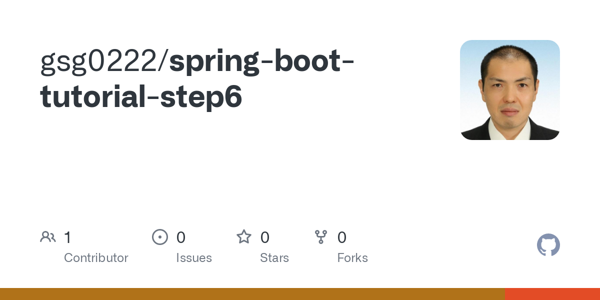

# [v3.1.0対応]Spring Boot入門：Spring Data JPAでデータベース操作

作成年月日：2021.10.31 更新年月日：2023.07.16

本記事ではSpring Data JPAというORM（Object-Relational Mapping：JavaのクラスとDBを橋渡しする）ツールを使って、データベースを操作する方法を説明します。

ORMツールはSpring Data JPA以外にもたくさんあって（MyBatis, DOMA, Spring JDBC, HIBERNATEなど）、それぞれ特徴が異なります。

今回Spring Data JPAを選んだのは、私がメインで使っているORMツールだからです。それぞれにメリット、デメリットがあるので、万が一プロジェクトで使うORMツールを選択することになった場合は、慎重に選んでください。

この記事は[Spring Boot入門：ServiceとDI(依存性の注入)](https://www.tsuchiya.blog/spring-boot-step5/)の続きとなります。


[v3.1.0対応]Spring Boot入門：ServiceとDI(依存性の注入)

この記事を読むとわかること

- H2 Databaseの設定方法
- Spring Data JPAの簡単な使い方

前提条件

- Spring Bootの開発環境が整っている
- 解説ではPleiades All in One Eclipseを使う
- Javaのバージョンは17
- Spring Bootのバージョンは3.1.0

関連記事

この記事は[Spring Boot入門](https://www.tsuchiya.blog/spring-boot-tutorial/)の一部です。環境構築の方法から初めて基本的なWebアプリケーションの開発に必要なことを説明しています。


Spring Boot入門:まとめページ

目次

1. [この記事のソースコード](https://www.tsuchiya.blog/spring-boot-step6/#toc1)
2. [Spring Bootプロジェクトを作成](https://www.tsuchiya.blog/spring-boot-step6/#toc2)
3. H2 Databaseの設定
   1. [そもそもH2 Databaseってなに？](https://www.tsuchiya.blog/spring-boot-step6/#toc4)
   2. [Spring BootでH2 Databaseを使えるように設定する](https://www.tsuchiya.blog/spring-boot-step6/#toc5)
   3. [データベースにテーブルを構築する](https://www.tsuchiya.blog/spring-boot-step6/#toc6)
4. Spring Data JPAの使い方
   1. [Entityクラス](https://www.tsuchiya.blog/spring-boot-step6/#toc8)
   2. [Repositoryインタフェース](https://www.tsuchiya.blog/spring-boot-step6/#toc9)
5. [その他の部分のコード](https://www.tsuchiya.blog/spring-boot-step6/#toc10)
6. [まとめ：ここまでできたら自分でアプリケーションを作れる！](https://www.tsuchiya.blog/spring-boot-step6/#toc11)

## この記事のソースコード

この記事のソースコードは[Githubに公開](https://github.com/gsg0222/spring-boot-tutorial-step6)しています。



GitHub - gsg0222/spring-boot-tutorial-step6

GithubからSpring BootプロジェクトをEclipseにインポートする方法は次の記事を参考にしてください。


GithubからSpring BootプロジェクトをEclipseにインポートする

## Spring Bootプロジェクトを作成

例によってプロジェクト名やパッケージは適当で大丈夫ですが、Spring Data JPAとテスト用データベースを構築するために、色々依存関係を追加する必要があります。

今回必要になる依存関係は以下のとおりです。

- Spring Boot DevTools
- lombok
- Validation
- Spring Data JPA
- H2 Database
- Thymeleaf
- Spring Web

次の画像のようになります。


だんだん依存関係が増えてきました。

## H2 Databaseの設定

H2 Databaseの設定から説明していきます。

### そもそもH2 Databaseってなに？

H2 DatabaseはRDBMS（Relational DataBase Management System）の一つです。MYSQL、PostgreSQL、Oracle、DB2などの仲間になります。

特徴としてはJavaで書かれていること、軽量なこと。今回のようにテストプログラムを組む用途でよく使われます。（要件によっては本番で使うこともあるかも）

### Spring BootでH2 Databaseを使えるように設定する

依存関係にはH2 Databaseを追加しましたが、それだけでは使えません。Spring Bootの設定ファイルに必要な記述をする必要があります。

Spring Bootの設定ファイルはsrc/main/resourcesにあるapplication.propertiesです。（ymlという形式で書くこともできますが、本サイトではpropertiesを使います）

このファイルに、以下のような設定を記述します。

```
# H2の設定
# 利用するドライバ、H2を使う場合はこの値で固定
spring.datasource.driver-class-name=org.h2.Driver

# インメモリで使い、データベース名はtestdbとする
spring.datasource.url=jdbc:h2:mem:testdb

# ここで指定したユーザが作成される
spring.datasource.username=sa

# 上で指定したユーザのパスワードを指定
spring.datasource.password=

# data.sqlをschema.sqlの後に読み込むように設定
spring.jpa.defer-datasource-initialization=true
```

H2 Databaseを使ったテストコードを作る場合には、この設定をそのまま使い回せば大丈夫です。設定の意味はコメントを見てもらえば大体わかると思います。

spring.jpa.defer-datasource-initializationだけはややこしいですが、要するにテーブルを作るSQLを実行した後にデータを登録するSQLを実行するよという設定です。

### データベースにテーブルを構築する

Spring Bootではsrc/main/resourcesにschema.sqlやdata.sqlというファイルが存在すると、起動時に実行してくれます。

Spring Boot 2.5より前はデフォルトでschema.sqlを実行してからdata.sqlを実行していたと思うのですが、2.5以降は仕様が変わったみたいで「spring.jpa.defer-datasource-initialization=true」という設定をapplication.propertiesに行う必要がありました。

この2つのsqlファイルで、Spring Data JPAから利用するテーブルを初期化します。

schema.sqlはBOOKテーブルを定義。

```
DROP TABLE IF EXISTS BOOK;

CREATE TABLE BOOK (
    ID IDENTITY NOT NULL PRIMARY KEY,
    TITLE VARCHAR(255) NOT NULL
);
```

data.sqlではBOOKテーブルに初期値を設定しています。

```
INSERT INTO BOOK(TITLE) VALUES ('Don Quijote de la Mancha');
INSERT INTO BOOK(TITLE) VALUES ('A Tale of Two Cities');
INSERT INTO BOOK(TITLE) VALUES ('The Fellowship of the Ring');
```

## Spring Data JPAの使い方

Spring Data JPAを使うためには、データベースの内容をマッピングするEntityクラスと、その Entity クラスをどのように操作するのかを定義するRepositoryインタフェースの2つを作成します。

### Entityクラス

Entityクラスはあるテーブル上の1カラムを意味するクラスです。基本的にカラムとフィールが1対1になるように設定します。（応用編としてはフィールドに外部キーを設定した他のクラスを設定することもできますが、ややこしいので今回は説明しません）

先程schema.sqlで定義したBOOKテーブルに対応するEntityクラスは以下のとおりです。

```
package blog.tsuchiya.tutorial.step6.model;

// v2.5.6から3.1.0にバージョン変更した際、パッケージがjavaxからjakartaに変更になりました
import jakarta.persistence.Entity;
import jakarta.persistence.GeneratedValue;
import jakarta.persistence.GenerationType;
import jakarta.persistence.Id;
import jakarta.validation.constraints.NotNull;
import jakarta.validation.constraints.Size;
import lombok.Data;

/**
 * 書籍を意味するエンティティクラス。
 * Entityアノテーションを付けるとデータベースのカラムを意味する
 * クラスとして扱える。
 */
@Entity
@Data
public class Book {

	/**
	 * フィールドにアノテーションを付けることで、制約を定義できる。
	 * Idアノテーションで主キーであること、
	 * GeneratedValueアノテーションで自動採番することを示している。
	 */
	@Id
	@GeneratedValue(strategy = GenerationType.IDENTITY)
	private Long id;

	/**
	 * こちらはNotNullでnullではないこと、Sizeで
	 * 最大文字が255文字であることを示している。
	 */
	@NotNull
	@Size(max = 255)
	private String title;

}
```

Entityクラスには@Entityアノテーションを付けます。このアノテーションを付けると、Spring Data JPAがこのクラスをEntityクラスだと判断して、必要なコードを自動的に追加してくれるわけです。

クラス名はテーブルの名前をパスカルケースにしたもの、フィールド名はカラム名をキャメルケースにしたものにします。テーブル名やカラム名にアンダースコアがある場合はそこを区切りにして名前をつければ良いです。（例えばAUTHOR_NAMEというカラムがあった場合、対応するフィールドはauthorNameになります）

各フィールドにはアノテーションを使って制約をつけることができます。テーブルを定義したときにカラムにつけた制約はEntityクラスでも同じように定義するべきです。

Bookクラスではidフィールドが主キーであり自動採番されること、titleが非nullで長さ255文字までであることをアノテーションを使って宣言しています。

@Id、@NotNull、@Size、@GeneratedValue以外はあまり使わないと思うのでとりあえずこの4つだけ覚えてください。

### Repositoryインタフェース

RepositoryインタフェースではEntityクラスに対する操作を定義します。インタフェースに必要なインタフェースを継承させると、実装はすべてSpring Data JPAが行ってくれます。SQLやJavaのコードを自分で書かなくても良いので非常に楽です。

```
package blog.tsuchiya.tutorial.step6.repository;

import org.springframework.data.jpa.repository.JpaRepository;
import org.springframework.stereotype.Repository;

import blog.tsuchiya.tutorial.step6.model.Book;

/**
 * データの永続化を行う。
 * 今回はJPAの仕組みを使うのでコンクリートクラスではなく
 * インタフェースを使っている。
 * JpaRepositoryを継承した@Repositoryのインタフェースを作成すると、
 * JPAが自動でコンクリートクラスを作成してくれる。
 */
@Repository
public interface MainRepository extends JpaRepository<Book, Long> {

}
```

必要なのは@Repositoryアノテーションをインタフェースに付けることと、JpaRepositoryインタフェースを継承することです。JpaRepositoryには操作対象のクラスとその主キーを指定します。今回の場合操作対象はBookクラス、主キーはLongです。

これだけで、以下のテーブルのような操作が実装されます。（よく使うものだけ、実際にはもっとたくさんある）

| **メソッド** | **説明**                                           |
| ------------ | -------------------------------------------------- |
| save         | 引数のインスタンスをデータベースに保存する         |
| findById     | 指定したIDでデータベースからインスタンスを取得する |
| findAll      | データベースからすべての行のインスタンスを取得する |
| count        | テーブルにある行数を取得する                       |
| delete       | 引数のインスタンスをデータベースから削除する       |
| existsById   | 指定したIDがデータベースに存在するかどうかを返す   |

主なRepositoryの操作

また、JpaRepositoryを継承したインタフェースにルールに沿ったメソッドを作成すると、やはり実装せずにいろいろな操作ができます。

例えば、

```
// タイトルに完全一致したインスタンスを1つだけ取得
Optional<Book> findByTitle(String title);
// タイトルを前方一致で検索した結果をリストで取得
List<Book> findByTitleStartingWith(String prefix);
```

MainRepositoryにこの様なメソッドを定義すると、自分でSQLを書かなくても自動でメソッド名に沿った実装がされます。

詳細は[Qiitaのこの記事](https://qiita.com/shindo_ryo/items/af7d12be264c2cc4b252)によくまとまっているので、複雑なクエリを実装したい場合は参考にすると良いでしょう。

## その他の部分のコード

残りはこれまでに学んだところなのでおまけですが、動かすために必要なのでソースを張っておきます。

サンプルコードを動かすにはSpring Bootを起動してhttp://localhost:8080/にアクセスしてください。

なお、ControllerからRepositoryを直接使わずにServiceを経由しているのは、各階層での責任を明確にするためです。ビジネスロジックはServiceに書き、データベースの操作はRepositoryが行うという責任分担になっています。

今回のサンプルのような規模では全く意味がありませんが、今後大きなプロジェクトを作成する際の練習だと思ってください。

```
package blog.tsuchiya.tutorial.step6.controller;

import java.util.Objects;

import org.springframework.stereotype.Controller;
import org.springframework.ui.Model;
import org.springframework.web.bind.annotation.RequestMapping;
import org.springframework.web.bind.annotation.RequestParam;

import blog.tsuchiya.tutorial.step6.service.MainService;
import lombok.RequiredArgsConstructor;

@Controller
@RequiredArgsConstructor
public class MainController {

	/**
	 * ControllerではServiceを呼ぶ。今回の機能を実装するだけなら
	 * このようにする必要はないが、今後規模が大きくなった際の
	 * 役割分担を意識している。
	 */
	private final MainService service;

	@RequestMapping("/")
	public String index(@RequestParam(required = false) String title, Model model) {

		// タイトルが入力されたらデータベースに保存する
		if (!Objects.isNull(title) && !title.isBlank()) {

			this.service.save(title);

		}

		model.addAttribute("books", this.service.findAll());
		return "index";

	}

}
```
```
package blog.tsuchiya.tutorial.step6.service;

import java.util.List;

import org.springframework.stereotype.Service;

import blog.tsuchiya.tutorial.step6.model.Book;
import blog.tsuchiya.tutorial.step6.repository.MainRepository;
import lombok.RequiredArgsConstructor;

/**
 * ビジネスロジックを記述するクラス。
 * ServiceからRepositoryを使うようにする。
 */
@Service
@RequiredArgsConstructor
public class MainService {

	private final MainRepository repository;

	/**
	 * 入力したタイトルを書籍データベースに登録する。
	 * @param title
	 */
	public void save(String title) {

		Book book = new Book();
		book.setTitle(title);
		this.repository.save(book);

	}

	/**
	 * すべての書籍データを返す
	 * @return 書籍データ
	 */
	public List<Book> findAll() {

		return this.repository.findAll();

	}

}
```
```
<!DOCTYPE html>
<html lang="ja" xmlns:th="http://www.thymeleaf.org">
<head>
<meta charset="UTF-8">
<title>書籍一覧</title>
<link href="https://cdn.jsdelivr.net/npm/bootstrap@5.1.1/dist/css/bootstrap.min.css" rel="stylesheet">
</head>
<body>
	<section class="border  p-1 m-3">
		<form method="post" th:action="@{/}">
			<div class="mb-3">
				<label for="title" class="form-label">タイトル</label>
				<input type="text" class="form-control" name="title" id="title">
			</div>
			<div>
				<button type="submit" class="btn btn-primary">送信</button>
			</div>
		</form>
	</section>
	<main class="border  p-1 m-3">
		<h1>書籍一覧</h1>
		<ul class="list-group">
			<li class="list-group-item" th:each="book : ${books}" th:text="${book.title}">An item</li>
		</ul>
	</main>
</body>
</html>
```

## まとめ：ここまでできたら自分でアプリケーションを作れる！

Spring Data JPAでデータベースを操作する方法を説明しました。SQLを自分で書かなくても良いので、敷居は低いと思います。

[Controllerの作成](https://www.tsuchiya.blog/spring-boot-step1/)から始まり、[Thymeleaf](https://www.tsuchiya.blog/spring-boot-step2/)（[ファイル分割](https://www.tsuchiya.blog/spring-boot-step3/)）、[入力チェック](https://www.tsuchiya.blog/spring-boot-step4/)、[Service](https://www.tsuchiya.blog/spring-boot-step5/)、そして今回でデータベース操作と説明してきました。これまでの記事で説明してきた内容が理解できていれば、簡単なWebアプリケーションは作成できます。

実践に勝る勉強はありません。簡単でいいので、何か動くアプリケーションを自分で作ってみましょう。色々エラーが出たりして大変だと思いますが、大きく成長できるはずです。

とりあえずの方針として、今回の記事で作ったプログラムを拡張するでも良いでしょう。サンプルプログラムは本の追加しかできないので、以下の機能を追加してみるとか。

- 本の削除と更新をできるようにする
- 本のタイトルだけでなく著者やISBNも管理できるようにする
- 複雑な検索を実装する

エラーが出たり思ったように動かなければ、[Twitter](https://twitter.com/gsg0222)や[お問い合わせフォーム](https://www.tsuchiya.blog/contact/)から連絡をください。できる限り対応します。

[Spring Boot入門:Spring Securityで認証と認可](https://www.tsuchiya.blog/spring-boot-step7-v3-1-0/)に続きます。