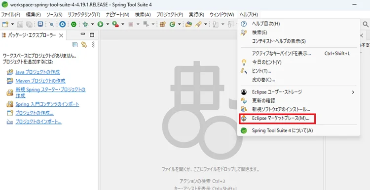
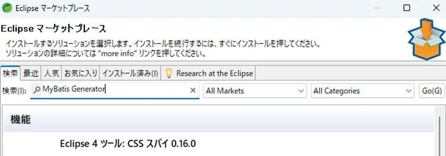
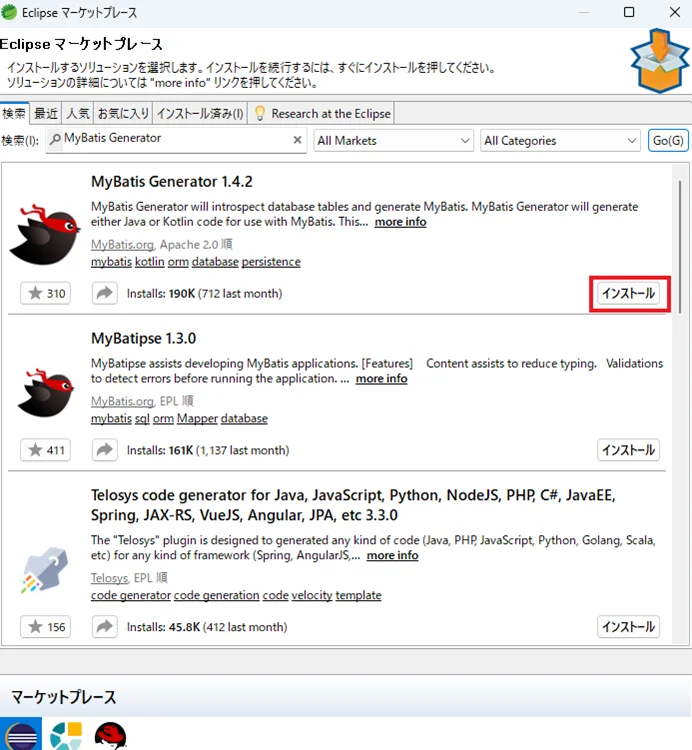
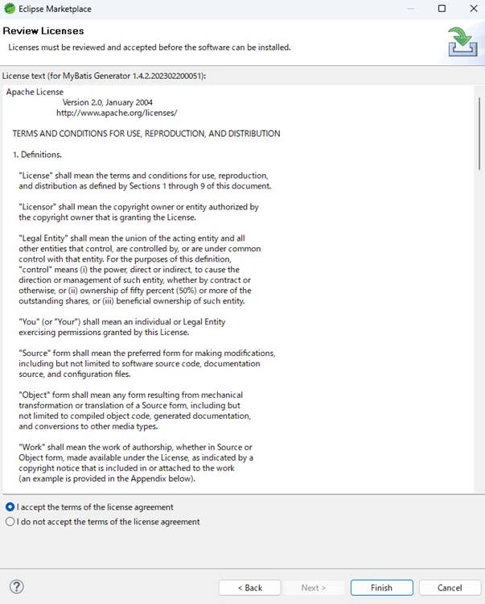
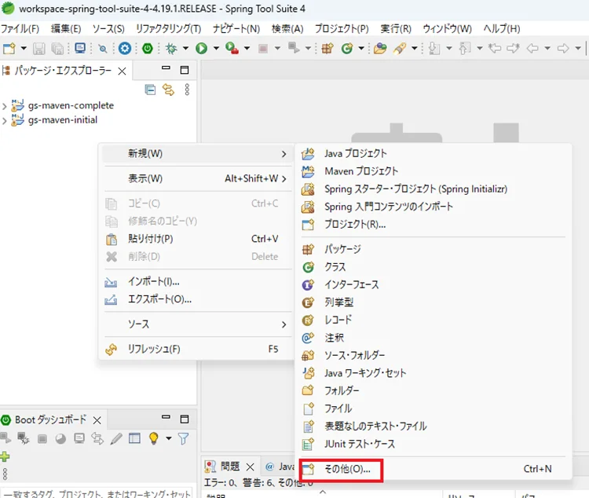
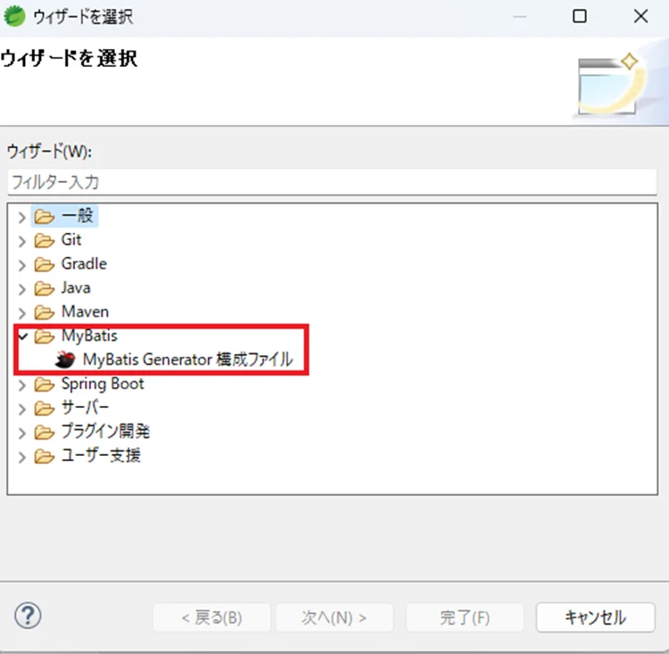

出所：[MyBatis（マイバティス）とは？その特徴や機能、イン…｜Udemy メディア (benesse.co.jp)](https://udemy.benesse.co.jp/development/mybatis.html)

最終更新日：2023(R5).11.28

取得年月日：2023(R5).11.28

# MyBatis（マイバティス）とは？その特徴や機能、インストール方法などを詳しく解説！

Javaとデータベースを紐付ける機能を持つJavaのフレームワークMyBatis（マイバティス）ですが、

・MyBatisがどのような役割を果たすのか分からない…。
・MyBatisを使う開発規模が分からない…。

と悩んでいる方もいらっしゃるのではないでしょうか？

そこでこの記事では、

・MyBatisの特徴や機能
・MyBatis Generatorのインストール方法
・どのような開発に適しているのか

についてご紹介します。

INDEX

- [MyBatis（マイバティス）とは？](https://udemy.benesse.co.jp/development/mybatis.html#MyBatis)
- [O/Rマッパーとは？](https://udemy.benesse.co.jp/development/mybatis.html#OR)
- [MyBatisの特徴](https://udemy.benesse.co.jp/development/mybatis.html#MyBatis-2)
- [MyBatisの機能](https://udemy.benesse.co.jp/development/mybatis.html#MyBatis-3)
- [MyBatis Generatorのインストール](https://udemy.benesse.co.jp/development/mybatis.html#MyBatis_Generator)
- [まとめ](https://udemy.benesse.co.jp/development/mybatis.html#i)

### MyBatis（マイバティス）とは？

**MyBatisとは、WebアプリケーションやWebシステムなどの開発の現場でよく使われるJavaのフレームワークです。**しかし、初心者の方々にとって、どのようなツールであるのかわからない方も多いでしょう。ここでは、MyBatisの概要をわかりやすく説明します。

#### MyBatisはJavaのフレームワークのひとつ

MyBatisは、Javaを使用してデータベース操作を行うフレームワークの名称です。Javaで書かれたアプリケーションとリレーショナルデータベース（RDB)との間のデータのやり取りの手間を少なくする、O/Rマッパーと呼ばれるツールに分類されます。

### O/Rマッパーとは？

Javaのオブジェクト（データと処理のまとまり）とリレーショナルデータベース(RDB)の情報を結びつけることをO/Rマッピングと言います。O/Rマッパーとは、情報を結びつけるための機能またはソフトウェアの総称です。通常、データベースから情報を取得するには、複数の手順が必要になります。一方で**O/Rマッパーを使用するとこれらの手順が省け、データベースへのアクセスが容易になります。**

#### 他のO/Rマッパーとの違い

O/Rマッパーという技術は、通常、データベースのテーブル（データの格納領域）とJavaのオブジェクトをつなげて扱うものです。この方法だと、**Javaでデータベースのテーブルと同じ形のオブジェクトを作れば、データの取り扱いがシンプルになります。**MyBatisはテーブルを使わず、SQLの実行結果に基づいてオブジェクトとの結びつけを行います。

MyBatis以外のO/Rマッパーとしては、HibernateやDoma2などがあります。これらのO/Rマッパーとの比較は、以下のようになります。

　　

|                   | MyBatis       | Hibernate | Doma2         |
| ----------------- | ------------- | --------- | ------------- |
| SQLの外部ファイル | 対応          | 非対応    | 対応          |
| マッピング        | SQLの実行結果 | テーブル  | SQLの実行結果 |
| 動的SQL           | 対応          | 自動生成  | 対応          |
| SQL               | 手動作成      | 自動生成  | 自動生成      |

　

### MyBatisの特徴

O/RマッパーであるMyBatisには、さまざまな特徴やメリットがあります。ここでは、MyBatisの特徴について詳しく解説していきます。

#### 開発効率が良い

MyBatisの導入により、データベース操作の複雑さが軽減され、Javaでの実装が効率的に行えます。**データベースへの接続関連のコードを大幅に省くことができる**ため、データベースを頻繁に利用するシステムでは、MyBatisの効果を大いに実感できます。結果として、開発の生産性が向上します。

#### 習得しやすい

MyBatisは機能的にはシンプルで学びやすく、データベースの基礎知識があれば利用可能です。XMLを用いた設定方法を理解すれば、**SQLでコードを書くだけでデータベースにアクセスできます。**

#### プラグインが豊富

EclipseやIntelliJといった総合開発環境には、MyBatis用のプラグインが豊富にあります。これらのプラグインを使うことで、アプリケーションの開発速度が向上します。

#### コスト削減効果

MyBatisはオープンソースとして提供されているので、ライセンスの費用がかかりません。これにより、商用ソフトウェアと比較してコストを低減できます。

#### 大規模な開発に向いている

MyBatisは大規模な開発に向いているフレームワークです。大規模な開発のデータベースでは「正規化」という手法を用いて情報の重複を防ぎます。この正規化は、データ検索時に複数のテーブルの結合が必要となります。テーブルを用いるO/Rマッパーの場合、この結合のためのコードが複雑になってしまいます。

その一方で、MyBatisはテーブル結合を踏まえたSQLを用意するだけで済みます。この効率性が、MyBatisが大規模な開発に向いている理由といえます。

### MyBatisの機能

さまざまな開発の現場で採用されているMyBatisには、さまざまな機能があります。ここでは、MyBatisの機能について解説します。

#### データマッピング機能

XMLにSQLを記述することで、Javaオブジェクトへのマッピングを自動で行います。データマッピング機能は、MyBatisのメイン機能といえます。

#### DBスキーママイグレーション機能

実際の開発現場では、開発の過程でデータベースのテーブル設計が変わるケースがあります。MyBatisのマイグレーション機能は、自動的にデータベースの変更を行う機能です。

#### コードジェネレータ機能

MyBatisの公式ツールであるMyBatis Generatorを活用すると、テーブルの情報をもとにJavaのコードを自動的に作成できます。

#### さまざまなフレームワークとの連携

MyBatisは、Spring FrameworkやGoogle Guiceなどの多様なJavaフレームワークと連携して使用することができます。

#### キャッシュ機能

キャッシュ機能を利用することで、同一の検索結果が要求された際には、SQLを実行することなくキャッシュ内のデータを取得可能です。

#### ロギング機能

ロギング機能を利用すると、データベースアクセスの他、実行されたSQLや使用されたパラメータもログに記録できます。

### MyBatis Generatorのインストール

MyBatis Generatorは、MyBatisの公式ツールとして、MyBatisに必要な各ファイルを自動的に作成する機能を持っています。ここでは、MyBatis Generatorのインストールなどについて詳しく解説します。

#### MyBatis Generatorとは

MyBatis Generatorは、データベースのテーブル情報から基本的なSQL操作ファイルを自動で生成できます。**MyBatisではSQLを手書きすることが基本ですが、多数のXMLやJavaBeanファイルを手動で作成するとミスが生じやすくなります。**特にテーブルやカラムが多い場合は、MyBatis Generatorの使用することで効率が大幅に向上し、ミスも減少します。

#### MyBatis Generatorのインストール方法

MyBatis Generatorのインストール方法は、以下の手順になります。

なお、MyBatis Generatorをインストールするためには、Javaと統合開発環境であるSTS（Spring Tool Suite）が既にインストールされている必要があります。

STSを開き、「ヘルプ」から「Eclipse マーケットプレース」をクリックします。

マーケットプレースの画面にある検索ウィンドウに「MyBatis Generator」と入力し、「Go」をクリックします。

「MyBatis Generator」の「インストール」をクリックします。

ライセンスの確認画面が表示され、画面下部の同意を選択して完了をクリックします。

再起動後、インストールは完了となります。

#### MyBatis Generatorのインストール確認方法

MyBatis Generatorが正しくインストールされているかを確認するには、以下の方法があります。

)

パッケージ・エクスプローラーの画面内で右クリックを行い、「新規」から「その他」を選びます。

「ウィザードを選択」の画面から「MyBatis」を選択します。ここで「MyBatis構成ファイル」または「MyBatis Generator Configuration File」が表示されていれば、インストールは正常に行われています。

### まとめ

この記事では、MyBatisに興味がある方に向けて、MyBatisの特徴や機能、MyBatisの公式ツールMyBatis Generatorのインストール方法などについて解説しました。MyBatisは、Javaを使用してデータベース操作を行うフレームワークです。MyBatisを活用することで、WebアプリケーションやWebシステムなどの開発の効率が向上します。MyBatisに興味がある方は、この記事を参考にMyBatisを導入してみてはいかがでしょうか。