出所：[【初心者必見！】pgAdmin4のまずは覚えておきたい使い方 (zenn.dev)](https://zenn.dev/codek2/articles/71a6b38cf3d6f2)

最終更新日：2023(R5).11.21

取得年月日：2023(R5).11.29

# 【初心者必見！】pgAdmin4のまずは覚えておきたい使い方

**ログイン**
postgresと入力し、OKをクリック
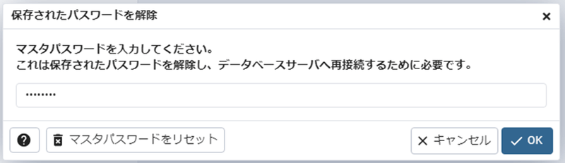

**画面に表示される文字の大きさ変更**
1.ファイル
2.設定
3.クエリツール
4.エディタ
5.フォントの大きさの数値を変更
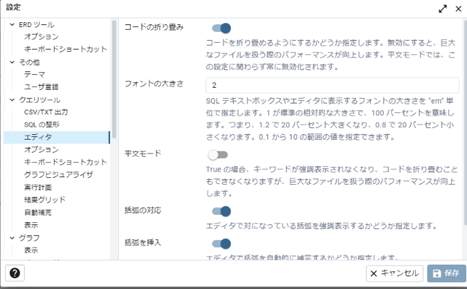

**データベース新規作成**
1.データベース上で右クリック
2.作成
3.データベース
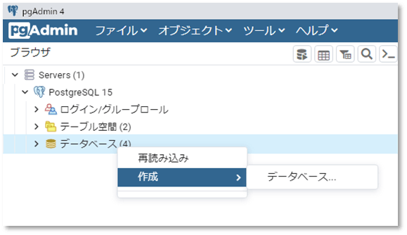

1.データベースの欄に適当な名前を入力し、保存をクリック
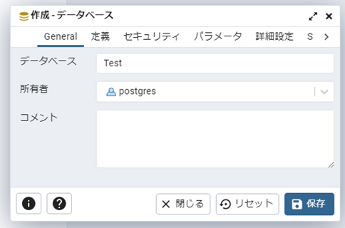

**SQL文を記述し、実行**
1.対象のデータベースを選択(例：Test)
2.クエリツールを選択
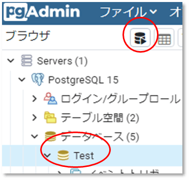

3.SQL文を記載
CREATE TABLE item(
"id" SERIAL NOT NULL ,
"name" VARCHAR(20),
"price" INTEGER,
PRIMARY KEY (id)
);

4.実行/更新(F5)
5.スキーマ→public→テーブルをだどって行くとテーブル名(例：item)が表示される
6.列をクリックするとフィールド名も表示される
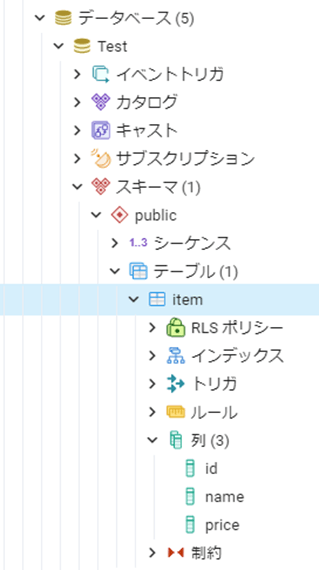

**データの挿入**
1.itemテーブルで右クリック→スクリプトを選択するとSQLの候補が表示される
例えばINSERTを選択
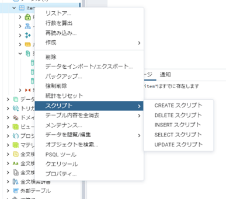

2.INSERT文を下記の様に修正し、実行
INSERT INTO public.item(name, price)VALUES ('りんご',100);
INSERT INTO public.item(name, price)VALUES ('ぶどう',300);
INSERT INTO public.item(name, price)VALUES ('バナナ',500);
3.成功すると「クエリが 67 ミリ秒 で成功しました。」などと表示される

**データの確認**
1.確認したいテーブルを選択
2.データを表示(Alt+Shift+V)
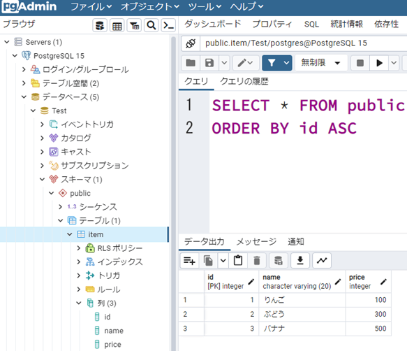

**テーブルの詳細などを確認する**
1.テーブル名(例：item)の上で右クリック
2.プロパティ
3.列の所をクリックすると詳細が確認出来る
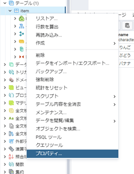

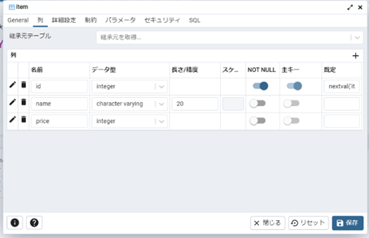

**シーケンス**
例）対象のデータベースを選択し、以下のSQLを実行
CREATE SEQUENCE seq_test
START WITH 5
INCREMENT BY 1
MAXVALUE 100;
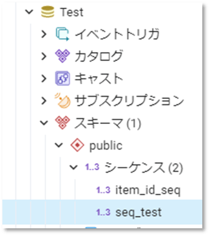

**ユーザ**
例）create user testuser with password 'testuser';を実行
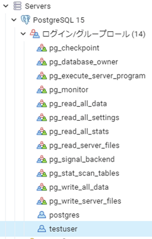

