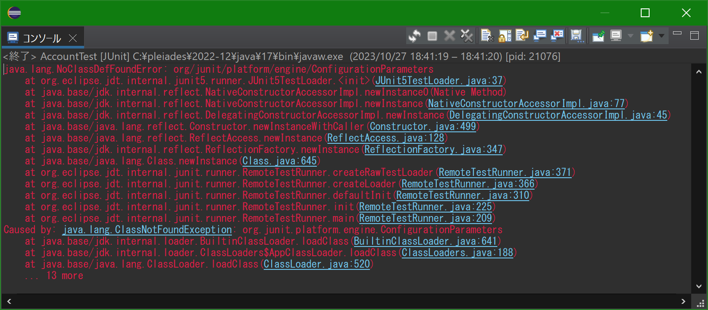
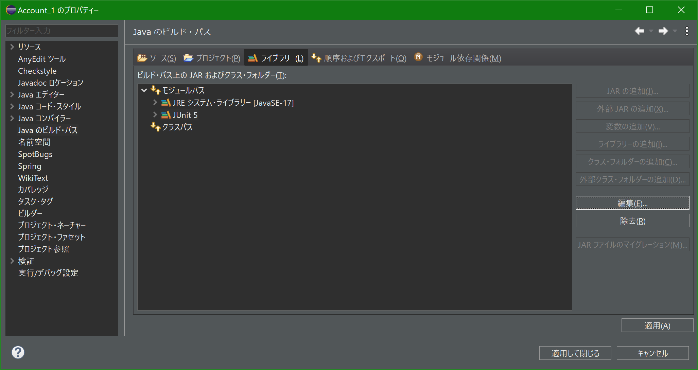
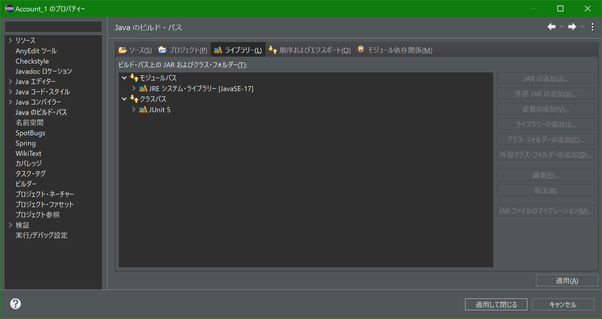

著者：三原　一成

執筆時期：2023(R5).10.27

コメント：本文書は、サーチマン佐藤の教材である「JUnitで単体テスト基礎講習」に関する補足である。

# 「JUnitで単体テスト基礎講習」に関する補足

### テストで実行時エラーとなった際の対処法

※本件は、[P2-EclipseでJunitを動かしてみる.pdf](file:C:/Users/Kazunari/Documents/0400サーチマン佐藤/JUnitで単体テスト基礎講習/Pdf/P2-EclipseでJunitを動かしてみる.pdf) の Page 16 of 21 で発生した問題である。

テストを実行した際に、実行時エラーとなった。その際に取得したエラーメッセージは次の通り。

````
java.lang.NoClassDefFoundError: org/junit/platform/engine/ConfigurationParameters
	at org.eclipse.jdt.internal.junit5.runner.JUnit5TestLoader.<init>(JUnit5TestLoader.java:37)
	at java.base/jdk.internal.reflect.NativeConstructorAccessorImpl.newInstance0(Native Method)
	at java.base/jdk.internal.reflect.NativeConstructorAccessorImpl.newInstance(NativeConstructorAccessorImpl.java:77)
	at java.base/jdk.internal.reflect.DelegatingConstructorAccessorImpl.newInstance(DelegatingConstructorAccessorImpl.java:45)
	at java.base/java.lang.reflect.Constructor.newInstanceWithCaller(Constructor.java:499)
	at java.base/java.lang.reflect.ReflectAccess.newInstance(ReflectAccess.java:128)
	at java.base/jdk.internal.reflect.ReflectionFactory.newInstance(ReflectionFactory.java:347)
	at java.base/java.lang.Class.newInstance(Class.java:645)
	at org.eclipse.jdt.internal.junit.runner.RemoteTestRunner.createRawTestLoader(RemoteTestRunner.java:371)
	at org.eclipse.jdt.internal.junit.runner.RemoteTestRunner.createLoader(RemoteTestRunner.java:366)
	at org.eclipse.jdt.internal.junit.runner.RemoteTestRunner.defaultInit(RemoteTestRunner.java:310)
	at org.eclipse.jdt.internal.junit.runner.RemoteTestRunner.init(RemoteTestRunner.java:225)
	at org.eclipse.jdt.internal.junit.runner.RemoteTestRunner.main(RemoteTestRunner.java:209)
Caused by: java.lang.ClassNotFoundException: org.junit.platform.engine.ConfigurationParameters
	at java.base/jdk.internal.loader.BuiltinClassLoader.loadClass(BuiltinClassLoader.java:641)
	at java.base/jdk.internal.loader.ClassLoaders$AppClassLoader.loadClass(ClassLoaders.java:188)
	at java.base/java.lang.ClassLoader.loadClass(ClassLoader.java:520)
	... 13 more
````

その際に取得した Eclipse のコンソールは、下図の通り。



問題の原因は、ビルドパスの設定ミスであった。下図では JUnit 5 が、「モジュールパス」に紐づいている。正しい紐づけ先は「クラスパス」であった。



紐づけ先を下図のように「クラスパス」へ修正し、問題を解決した。



------

