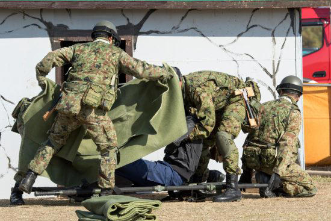
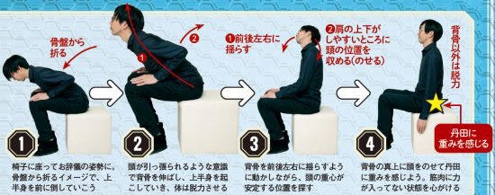
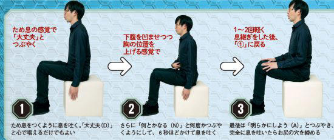

[陸上自衛隊初の心理幹部が教える「強メンタル」のつくり方。感情の乱れを静める“DNA呼吸法”とは (msn.com)](https://www.msn.com/ja-jp/health/other/陸上自衛隊初の心理幹部が教える-強メンタル-のつくり方-感情の乱れを静める-dna呼吸法-とは/ar-AA1mFQnZ?ocid=winp1taskbar&cvid=c7f353e2294447c9864d0f5cf20b9db8&ei=33)

# 陸上自衛隊初の心理幹部が教える「強メンタル」のつくり方。感情の乱れを静める“DNA呼吸法”とは

理不尽な上司やわがままな部下、さらには居丈高な取引先との軋轢から、誰しもメンタルをやられてしまうことはある。ストレスフルな時代と言われている今、強メンタルを手に入れるにはどうすればいいのか？　打たれ強く生きるためのノウハウを学ぶ。

◆自衛隊式！3つの魔法の言葉をつぶやくDNA呼吸法

※写真はイメージです© 日刊SPA!

社会にはいかにストレスフルな環境下であっても、強い義務感によって職務の遂行を期待される仕事や組織がある。その一つが自衛隊だ。

「有事でもパニックに陥らず、いつも通りの判断を下せること。究極的にはそれが戦場の兵士に求められるメンタルです」

こう語るのは、陸上自衛隊初の心理幹部という経歴を持つメンタルレスキュー協会理事長の下園壮太氏。

「不安や緊張が強い心理状態では、普段のパフォーマンスは発揮できません。同じ事象でも、うつ状態の人のほうが普通の人の2～3倍もダメージを受ける。つまり、強メンタルの持ち主とは、常にうつ状態を避けられる人や“平常心だと自分がしないような失敗”を冷静に回避し続けられる人と考えていいと思います」

◆DNA呼吸法で感情の乱れを静める

下園氏によると、常に強メンタルでいるために重視すべきなのは「睡眠」だという。

「自衛隊員にも徹底して指導してきましたが、まずは9時間を目安に睡眠を取るよう心がけてください。基本的なことに思えるかもしれませんが、実は日本人の大半は自覚なく慢性的な睡眠不足に陥っています。弱メンタルに対する最高のクスリは睡眠。精神安定剤などを求めるとメンタルはかえって弱くなります」

だが、現実には戦場の兵士と同様、会社員でも寝不足の疲労状態で頑張らなければならないときがある。そこで普段の自分を一時的に取り戻すのに効果的なのが「DNA呼吸法」。

◆3つの言葉とは…

「大丈夫（D）」、「何とかなる（N）」、「明らかにしよう、よく見よう（A）」の頭文字をとった最強のメンタルトレーニング法だ。

「この呼吸法はわざと難しくすることによって、自然と意識がDNA呼吸法に向くようにしています」

呼吸の回数は目安だが、まずはコツを摑むために5回を1セットとして最低一日40回は繰り返すべきだという。

「銃弾が飛び交う前線では新兵が普段通りに体を動かせないように、会社員も上司との衝突など強いストレスを感じると簡単な仕事すら手につかなくなる。自分を攻撃してくる存在が近くにあると、防御態勢に入るため、緊張が緊張を呼び急激に心身を消耗してしまうのです。そんなときは一度その場から離れ、DNA呼吸法を行う。それだけで強いメンタルを保てます」

睡眠とDNA呼吸法をうまく取り入れれば、何があってもうつに陥らないハガネの強メンタルが手に入るのだ。

◆感情の乱れを静めるDNA呼吸法

●第一段階「姿勢」

感情の乱れを静めるDNA呼吸法 第一段階「姿勢」© 日刊SPA!

①椅子に座ってお辞儀の姿勢に。骨盤から折るイメージで、上半身を前に倒していこう

②頭が引っ張られるような意識で背骨を伸ばし、上半身を起こしていき、体は脱力させる

③背骨を前後左右に揺らすように動かしながら、頭の重心が安定する位置を探す

④背骨の真上に頭をのせて丹田に重みを感じよう。筋肉に力が入ってない状態を心がける

椅子に座り姿勢をつくる。体の重心を感じるには集中力が必要。姿勢をとるだけでストレスの原因に向いた意識を忘れることができそうだ。頭の中で骨盤から背骨がしっかりと立っているイメージを浮かべることが大切だ。

●第二段階「呼吸法」

感情の乱れを静めるDNA呼吸法 第二段階「呼吸法」© 日刊SPA!

①ため息をつくように息を吐く。「大丈夫（D）」と心で唱えるだけでもよい

②さらに「何とかなる（N）」と何度かつぶやくようにして、6秒ほどかけて息を吐く

③最後は「明らかにしよう（A）」とつぶやき、完全に息を吐いたらお尻の穴を締める

やり方は少しくらい違っても大丈夫。目安は5セットだが、時間がないときは1セットでもやることが大事だ。「集中しやすいようにあえて複雑にしています。アレンジしてOK。吐くほうを長く意識するのがコツです」（下園氏）

【メンタルレスキュー協会理事長・下園壮太氏】

元・陸上自衛隊衛生学校心理教官として多くのカウンセリングを行う。『とにかくメンタル強くしたいんですが、どうしたらいいですか？』（サンマーク出版）など著書多数